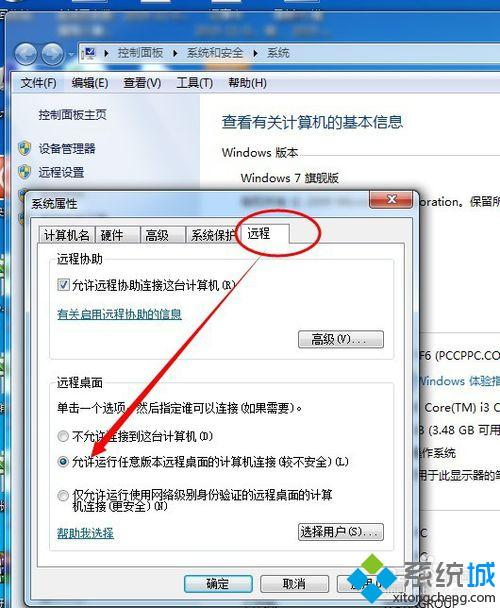
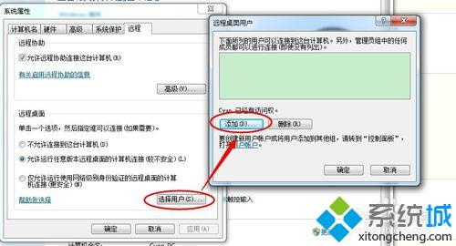
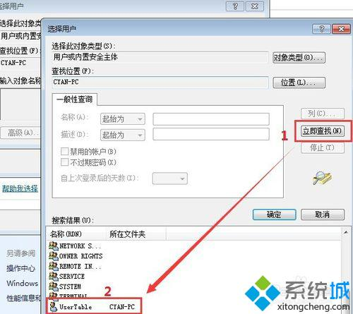
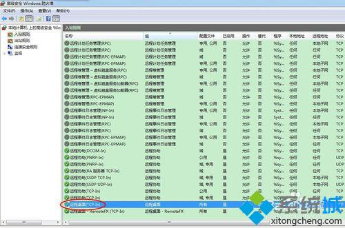
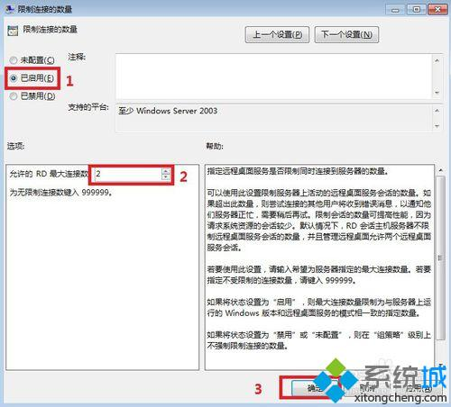
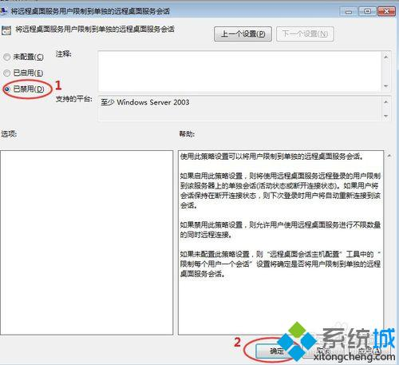
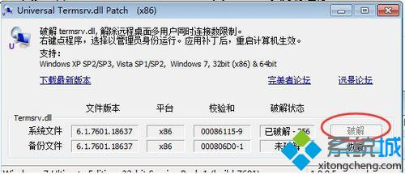

### 如何实现多用户同时远程登陆Window7系统
通常Window7只能实现单一用户同时登陆系统，一旦有其他用户远程登陆，那么已登陆用户将被挤下来，因此我们需要借助一个小工具来实现多用户登陆。在运行小工具之前，我们需要对系统进行一些必要的设置：
1. 创建管理员帐号（需要设置密码）。步骤：控制面板-用户-新建用户-增加密码；
2. 开启计算机远程。步骤：点击计算机，右键-属性-远程设置-勾上允许任意版本远程桌面的计算机连接；

3. 将新建用户添加到远程桌面组。步骤：在远程设置里面，点击用户-添加；

4. 在选择用户里面，点击高级-立即查找，找到刚刚创建的需要远程的用户，依次点击确定。一般管理员账号的不需要再添加的。管理员账号本来就属于远程账号组；

5. 防火墙如果是开着的，就需要确认是否开启远程桌面服务。控制面板-系统和安全-Windows 防火墙-高级设置-入站规则。确认远程桌面是服务是启用状态；

6. 点击开始菜单-运行-输入“gpedit.msc”进入本地组策略编辑器；
7. 在本地组策略编辑器里面，依次展开计算机配置-管理模板-Windows组件-远程桌面服务-远程桌面会话主机-连接-限制连接的数量；

8. 打开“远程桌面服务用户限制到单独的远程桌面服务会话”，点击已禁用，然后确定；

9. 下载一个universal termsrv.dll patch。

